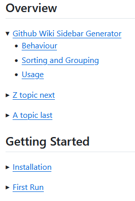

# Github Wiki Sidebar Generator
This program processes a folder of markdown files and creates an *_Sidebar.md* file suitable for use as the Github Wiki sidebar. The result is similar to the sidebar automatically generated by github except:
* the order of the links can be user defined and links can be grouped under a topic header.
* instead of using the file name for the collapsable item with the glyph and the H1 header as the first collapsed item, the H1 header is the collapsable item with the glyph and the subheadings are the collapsed items.
* the sidebar section does not automatically open when its page is viewed (would like that, coudn't figure out how).

## Behavior
The program scans each file in the specified folder and extracts the markdown headers (i.e. lines beginning with #, ##, etc). It does not process sub-folders.

It expects one H1 header (starts with #) to use as the name of the link to the file. The H1 link becomes a collapsable item in the sidebar. If the H1 header is the only header in the file, the program still creates a collapse glyph (that doesn't do anything) to keep all items aligned in the sidebar.

If the file does not contain an H1 line, the name of the file is used as the link text.

Subsequent headers (H2 and up) in the file become anchor links indented and collapsed under the H1 link. The program assumes headers will be used hierarchically, e.g. an H4 directly below an H2 would be indented too far.

The program expects header text to be unique within a file.

## Sorting and Grouping
The program can optionally use a JSON definition file to automatically group links under a user-defined markdown header and implement a user-defined order for the H1 links. H2 and up links are presented in the order found in the markdown file.

The JSON file specifies the group name and a list of the associated H1 headers. The sidebar is created in the order of the JSON file.

The program uses the JSON file to:
1. Generate group headers using the keys.
1. Arrange keys in line order, top to bottom.
1. Arrange the values as links in the group starting from leftmost.

Any H1 headers from the files that are not found listed in the JSON file are placed under an "Ungrouped" header. Any H1 header names in the JSON file that do not have a matching header in a markdown file are ignored.

For example, a JSON file of:

```json
{
  "Overview": ["Github Wiki Sidebar Generator", "Z topic next", "A topic last"],
  "Getting Started": ["Installation", "First Run"]
}
```

would look like this:



## Usage
1. All you need from this repository is the _sidebar.py_ file.

1. "Clone this wiki locally" from your github wiki page. (You may need to create a repository access token. There should be a how-to link provided if you clone from a command prompt.)

1. If you want grouping and sorting, create a JSON file formatted as shown above.

1. Run _py sidebar.py -h_ to see program help. Then run the program with appropriate parameters (clone folder name and github user/repository are required) to generate the output file.

1. You probably want to review the local file with a markdown viewer before uploading it to github, for example to see if there are any "Ungrouped" links (which means the JSON file is incomplete). The links should work for files that already reside on github.

1. Copy/Paste the contents of the output file to your custom sidebar on github, or commit the *_Sidebar.md* file using git if you made that file in the clone folder.